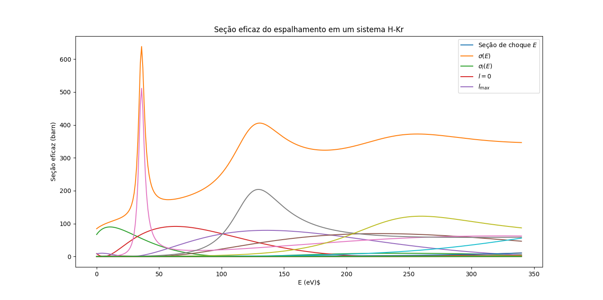

---
datapackage:
  title: Cross section scattering of H2 - Ar and H2 - Xe
  description: Numerical simulation of cross-section based on "Molecular beam scattering studies of orbiting resonances and the determination of van der Waals potentials for H–Ne, Ar, Kr, and Xe and for H2–Ar, Kr, and Xe"
  licenses:
  - path: http://opendatacommons.org/licenses/pddl/
    title: Open Data Commons Public Domain Dedication and License v1.0
  resources:
  - path: h2ar/resultado.csv
    title: Cross section scattering
    name: cross-section
    format: csv
    schema:
      fields:
      - name: x
        type: number
      - name: y
        type: number
      - name: z
        type: number

  - path: h2xe/resultado.csv
    title: Cross section scattering
    name: cross-section
    format: csv
    schema:
      fields:
      - name: x
        type: number
      - name: y
        type: number
      - name: z
        type: number

  - path: h2xe/resultado.csv
    title: Cross section scattering
    name: cross-section
    format: csv
    schema:
      fields:
      - name: x
        type: number
      - name: y
        type: number
      - name: z
        type: number

  - path: iris.csv
    title: Iris
    name: iris
    format: csv
    schema:
      fields:
      - name: sepal_length
        type: number
      - name: sepal_width
        type: number
      - name: petal_length
        type: number
      - name: petal_width
        type: number

                                                                                                                                                                                                                                                                                                
---

Simulation result (H2+ - Ar):

$$\frac{\partial f}{\partial t} + \mathbf{v} \cdot \nabla f + \mathbf{g} \cdot \nabla_{\mathbf{v}} f = Q(f, f)$$

<PlotlyLineChart
  data={{
    url: 'https://raw.githubusercontent.com/LuisVCSilva/cross_section_scattering/main/h2ar/resultado.csv'
  }}
  title="Cross section"
  xAxis="x"
  yAxis="y"
/>

H2 + Xe:
<PlotlyLineChart
  data={{
    url: 'https://raw.githubusercontent.com/LuisVCSilva/cross_section_scattering/main/h2xe/resultado.csv'
  }}
  title="Cross section"
  xAxis="x"
  yAxis="y"
/>

Here are some notes about the problem:

# Draft

A study on cross-section scattering

## Idea

The aim is to understand the phenomenon of scattering between the atom of hydrogen and some other inert noble gas, through some procedure, preferably numerical. For this example, I chose the scattering of a Hydrogen particle (lighter) by a potential of a Krypton particle (heavier), for which experimental results were published by Toennies[1]. My goal was to replicate the results developed in the article numerically. For this, the system equation was formulated from the Schrödinger equation, and it was solved numerically (with a Lennard-Jones potential to model the interaction between particles) to obtain total and partial cross-sections (as well as wave function, asymptotic wave function, effective potential).

Thus, the Schrödinger equation of the system was solved:

$$ H \Psi = E \Psi $$

$$ \left [ - \frac{\hbar^2}{2m} \Delta + V(r) \right ] \Psi (\vec{r}) = E \Psi (\vec{r}) $$

where $V(r)$ is a spherical potential. It is known that in this case, all the eigenfunctions of the system are also eigenfunctions of the angular momentum operators, that is, they can be rewritten as linear combinations of spherical harmonics in the form:

$$ \Psi(\vec{r}) = \sum_{l=0}^{\infty} \sum_{m=-l}^{l} A_{lm} \frac{u_l(r)}{r} Y^{m}_{l} (\theta, \phi) $$

By applying the separation of variables, this reduces the problem to the radial case of the equation, where the problem is a function of the coordinate $r$ that varies from $0$ to $\infty$, $m$ is the reduced mass of the entire system.

$$ \left [ - \frac{\hbar^2}{2m} \frac{d^2}{dr^2} + \left ( V(r) + \frac{\hbar^2 l (l+1)}{2mr^2} - E \right ) \right ] = u_l(r) = 0 $$

The phase shifts $\delta_l$ (dependent on potential and energy) are calculated from the asymptotic behavior of the wave function as follows:

$$ \tan \delta_1 = \frac{Kj_l(kr_1)-j_l(kr_2)}{K n_l(kr_1) - n_l(kr_2)} $$

where $k = \sqrt{2m E \hbar^{(-2)}}$, $K = r_1 u_2 (r_2 u_1)^{-1}$ and $u_{1,2} = u_l(r_{r1,2})$, and where $j_l$ and $n_l$ are Bessel functions and $r_1 \approx r_2 \approx r_{\text{max}}$. Thus, the total cross-section is given by:

$$ \sigma_{\text{total}} = \frac{4 \pi}{k^2} \sum_{l=0}^{\infty} (2l+1) \sin^2 \delta_l $$

Using the Lennard-Jones potential to model the interaction between the two atoms, we have:

$$ V_{LJ}(r) = \epsilon  \left [ \left (  \frac{\sigma}{r}  \right ) ^{12} - 2 \left ( \frac{\sigma}{r}  \right )^6  \right ] $$

where $\epsilon = 5.9$ meV and $\sigma = 3.57$.

## Results

The graph below is the numerical solution of the system showing the series of variables of interest, followed by the original graph in the experimental article:

In the experiment, the center of mass energy in electronvolts (eV) was related to the total cross-section $\sigma$ in barns. The solver was written in Python and used the Numerov algorithm to solve the system equation, the Scipy library for Bessel functions, Numpy for matrix and series operations, and Matplotlib for plots. The file `solver.py` simulates the cross-section resulting from the H-Kr interaction under the parameters specified in `params.json`, a CSV file containing the series of interest can be generated and plotted with the script `plot.py`. The entire procedure can be executed with the file `run.sh`.

As mentioned earlier, the numerical result seems to be in agreement with the experimental results conducted by Toennies[1].

## Future Work

Future research can explore the following areas:

- Exploring other models that describe intermolecular interaction more accurately (instead of Lennard-Jones), for example with non-parametric models generated with machine learning.
- Using other integration methods besides Numerov (e.g., integral formulation of the problem).
- Adaptive meshes.
- Code parallelization.
- Simulation of complex molecules with interesting applications (material characterization).

## References

<PdfViewer
  data={{
    url: 'https://cdn.filestackcontent.com/wcrjf9qPTCKXV3hMXDwK'
  }}
  parentClassName="h-96"
/>

I tried to include a PDF file but couldn't, not sure why, tried the pdf url and the blob one.

Cannot plot multiple series in the same plot :|

